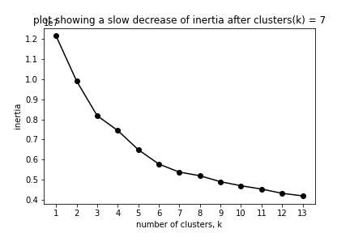

# Data Analysis Challenge: Clustering

## Introduction

- The purpose of this task is to demonstrate your skills for the role of a data scientist.
- The task is composed of a single problem, in which you need to analyze some data and build a model.

## Data

You have a data table (`sample_data.csv`) in which each row represents an independent experiment and each column represents one measurement (feature) of the experiment. The first column (`ref_group`) defines the experimental condition.

A subset of these experiments belongs to the so called `reference groups` which are apparent by the `group` column:
- reference group A: `group` == `group_A`
- reference group B: `group` == `group_B`
- reference group C: `group` == `group_C`
- reference group D: `group` == `group_D`
- reference group E: `group` == `group_E`

These groups represent so-called control experiments. For the majority of the experiments (`group` == `unknown`), we do not know which group they belong to. They may belong to one of the reference groups or to a group that we do not know yet.

## Goal

We want to cluster our experiments into distinct groups. We know our 5 reference groups, and some of the unknown experiments might belong to one of these groups. We also expect to find new groups (clusters) among the `unknown` experiments.

### Quality criteria for the clustering

We have **good clusters** if
- samples from a given reference groups fall into a single cluster.
- if novel reference groups exist, they are discovered and clustered accordingly.

## The Task

Develop a data science pipeline to find new clusters among the unknown experiments.

- Be aware that pure supervised classification based on reference groups does not work, because you want to find novel classes.
- Build a clustering quality measure based on the quality criteria described above. Optimize your clustering based on that measure.
- Be aware that not all features are relevant for the clustering. Develop a strategy to determine relevant features, or to reduce redundant information within the data set.

## Deliverable

- A report where you outline your data analysis strategy and present results in written form together with illustrative plots.
- Your source code. Documented and runnable source code
- Please describe approach and methodology used for reaching the goals and analysis steps you have done and why.
- Your line of reasoning is important!

## Deadline

Two weeks after email. Let me know if you need more time.

## What else?

- If you have questions regarding the data set for your analysis, write to me at miguel.fernandes@dzne.de
- Have fun with it and good luck! :)

## Proposed Solution(PCA + KMeans):
- Step-0: Create conda environment using : 
 ```
   conda env create -f environment.yml
 ```
- Step-1: Load the raw data and explore it for cleaning the missing values.
- Step-2: As the data is high dimensional (10443, 1488), it is required to reduce the dimensionality.
- Step-3: Used PCA (Principal Component Analysis) to reduce the dimensions to (10443,46) which covers 95% data variability.


- Step-4: Now, perform clustering on the PCA components using KMeans clustering method from scikit-learn.

- Step-5: The above plot shows no variability in inertia after clusters-7. Therefore, I would conclude the optimum number of clusters is 7.

